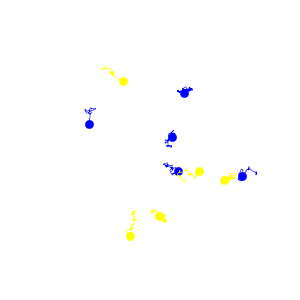
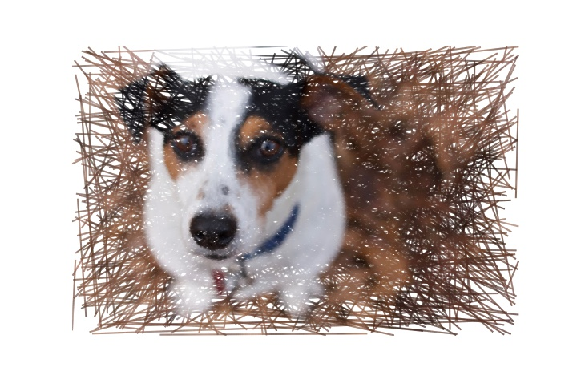
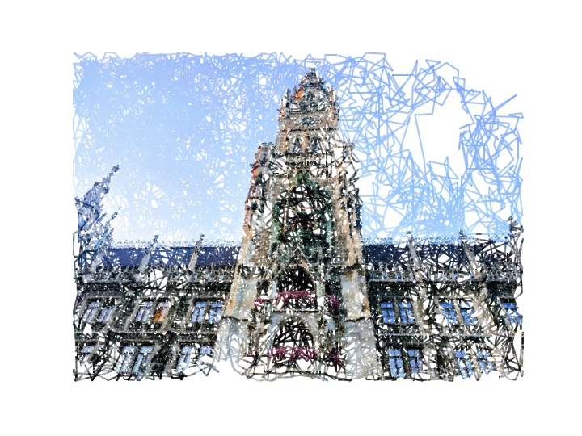
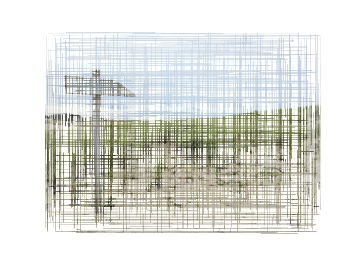
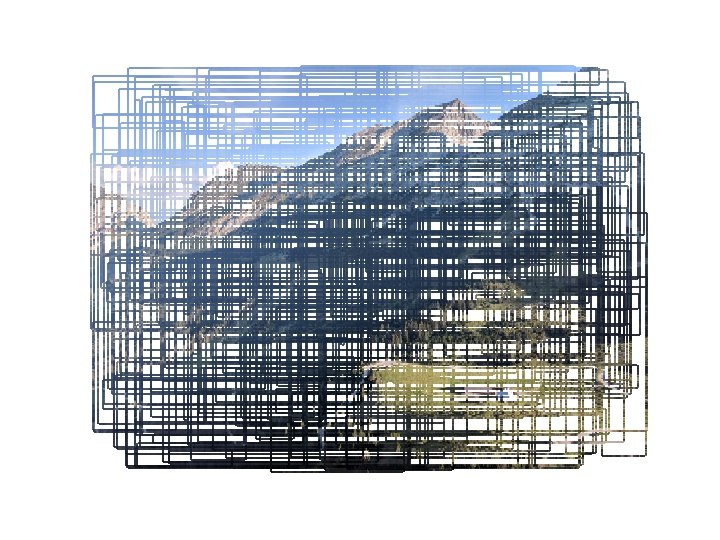
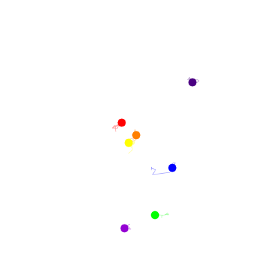
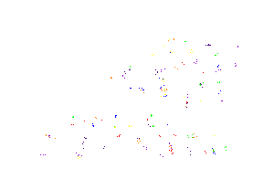

[](https://travis-ci.org/ColCarroll/imcmc)
[](https://coveralls.io/github/ColCarroll/imcmc?branch=master)

*It probably makes art.*

`imcmc` (*im-sea-em-sea*) is a small library for turning 2d images into probability distributions
and then sampling from them to create images and gifs. Right now it is best at logos and shape based images.

Installation
------------

This is actually `pip` installable from git!

```bash
pip install git+https://github.com/ColCarroll/imcmc
```

Quickstart for logos and gifs
-----------------------------

See [imcmc.ipynb](examples/imcmc.ipynb) for a few working examples as well.

```python
import imcmc


image = imcmc.load_image('python.png', 'L')

# This call is random -- rerun adjusting parameters until the image looks good
trace = imcmc.sample_grayscale(image, samples=1000, tune=500, nchains=6)

# Lots of plotting options!
imcmc.plot_multitrace(trace, image, marker='o', markersize=10,
                      colors=['#0000FF', '#FFFF00'], alpha=0.9);

# Save as a gif, with the same arguments as above, plus some more
imcmc.make_gif(trace, image, dpi=40, marker='o', markersize=10,
               colors=['#0000FF', '#FFFF00'], alpha=0.9,
               filename='example.gif')
```



Quickstart for color images
---------------------------

See [crosshatch.ipynb](examples/crosshatch.ipynb) for a few working examples as well.

```python
import matplotlib.pyplot as plt

from imcmc.color import (
    ImageLines,
    IntensityMCMCStrategy,
    UniformLinesStrategy,
    GibbsIntensityStrategy
)

pete = plt.imread('color/pete2.jpg')

ImageLines(pete, UniformStrategy()).plot()
```



```python
munchen = plt.imread('color/munchen.jpg')

ImageLines(munchen, IntensityMCMCStrategy(step_size=500)).plot(10_000)
```



```python
beach = plt.imread('color/beach.jpg')

ImageLines(beach, UniformLinesStrategy()).plot(1500, linewidth=1)
```



```python
karwendel = plt.imread('color/karwendel.jpg')

ImageLines(karwendel, GibbsIntensityStrategy()).plot(1_000)
```



Built with
----------

`Pillow` does not have a logo, but the other tools do!




Here's a tricky one whose support I appreciate
----------------------------------------------

I get to do lots of open source work for [The Center for Civic Media](https://civic.mit.edu/) at
MIT. Even better, they have a super multi-modal logo that I needed to use 98 chains to sample from!


